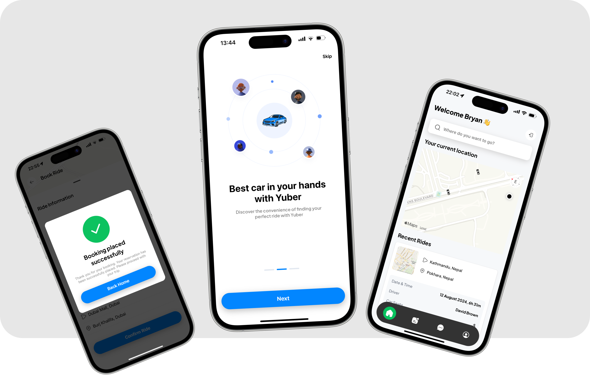
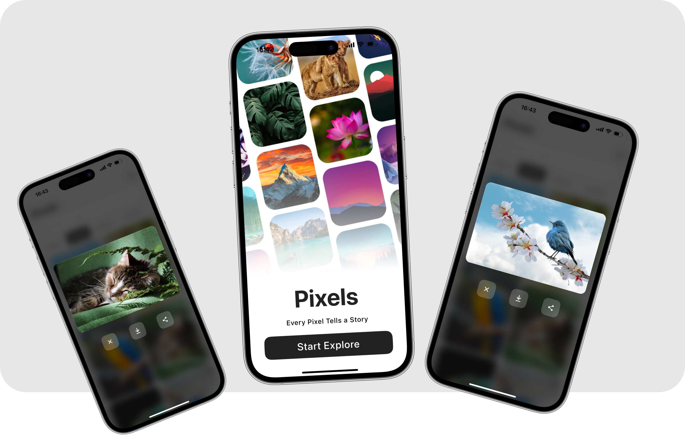

# React Native Apps

This repository consolidates all the React Native projects on my page into one place for easy access.

## Yuber

Yuber is a ride-booking application that provides a seamless and secure user experience. The app features full user authentication and sign-in with Google, powered by Clerk, ensuring a streamlined registration and login process. User data is securely stored on Neon, a serverless Postgres platform. Yuber's main screens include a ride history view, a user profile section, and a booking interface. To book a ride, users select their start location—defaulting to their current location—and choose a destination. Yuber then suggests nearby drivers, providing detailed information such as pricing, distance, fees, and available car seats. Payment for rides is conveniently handled through Stripe, allowing users to enter their payment details and confirm their ride with ease. Once payment is complete, users are ready to embark on their journey.

<b>Tools Used: React Native, Expo Go, Clerk, Neon, Stripe, Geoapify, TailWindCSS</b>

[Repo Link](https://github.com/MosesDVarghese/uber-clone)

### Sample Image

## LinkUp

This is a project to create a Social Media mobile application using React Native with complete user authentication.App features full CRUD functionality: edit user profile, create post with caption and / or photo or video, commenting on posts. The create post function features rich text editor, allowing for text styling, resizing, alignment, undo and redo functionality, enabling users for expressive and engaging posts.

<b>Tools Used: React Native, Expo Go, Supabase</b>

[Demo Video](https://github.com/MosesDVarghese/supa-social-app/blob/master/assets/videos/demo-video.mp4)

[Repo Link](https://github.com/MosesDVarghese/supa-social-app)

### Sample Image

## Pixels

Pixels is an application that fetches images according to search results. Can also search by color. Utilizes Pixabay API for image fetching. Implements debouncing in search functionality.

<b>Tools Used: React Native, Expo Go, Pixaby API</b>

[Repo Link](https://github.com/MosesDVarghese/wallpaper-app)

### Sample Image

## Discord UI

This is a project to recreate Discord's UI. Feel free to use this for your own learning. Below are screens that are currently completed.

<b>Tools Used: React Native, Expo Go</b>

[Repo Link](https://github.com/MosesDVarghese/discord-app-v2.0)
